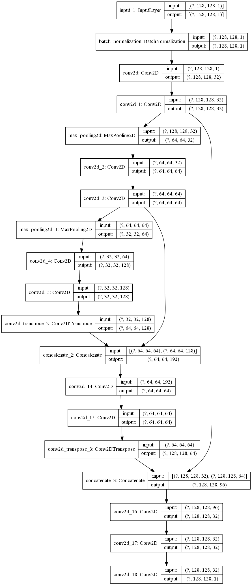

# Kaggle-Ultrasound_Segmentation
 
This project is solution to Kaggle competition: [Ultrasound Nerve Segmentation](https://www.kaggle.com/c/ultrasound-nerve-segmentation/overview)

## Challenge

The goal of this challenge is to build a model to identify the nerve structures in ultrasound images of the neck.

Motivation bahind the challenge is to improve pain management through the use of indwelling catheters on the neck, thus accurately identifying the nerve structures on patient's nack is a critical step to effectively insert a catheter.

Kaggle given us the ultrasound images and mask images of the location of the nerve system: (animation is from [Kaggle notebook](https://www.kaggle.com/chefele/animated-images-with-outlined-nerve-area))

## Image processing

By eye balling the training images and masks, no image augmentation is needed since the nerve structures are at similar locations in ultrasound images and have similar shapes. Need to resize images (I choose 128 x 128) to conserve memory.

## Modeling

I use the U-Net architect with less kernels and dice coefficient as metrics for my segmentation model:

## Result

Following GIF images show the predicted masks (blue) and true masks (red) after 30 epochs of training. The final model can **predict the core area of nerve structure and cover 62% of the true masks** based on dice coefficient metrics. The model can even **identify the target while ultrasound probe moves**, which during the transition the images are shaky and difficult to label manually. Some predictions have noise but the target location has the biggest mask area.

